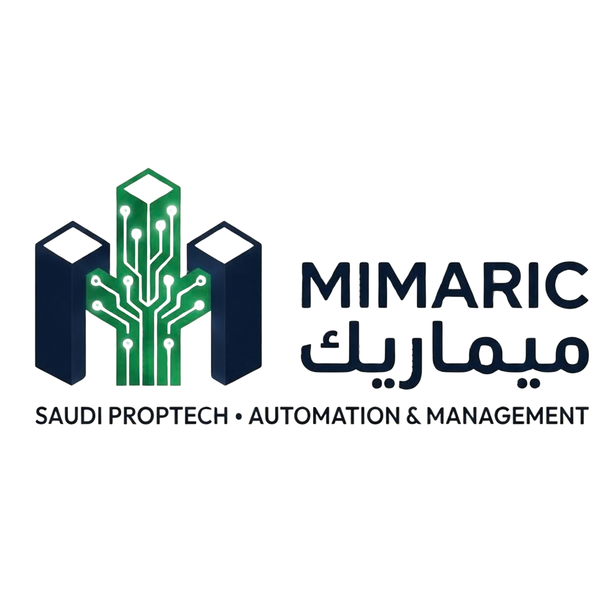

# MIMARIC — Brand Identity Guidelines
### ميماريك | Saudi PropTech • Automation & Management

**Version 2.0 — March 2026**
*Prepared by Omar Al-Ghamdi | For AntiGravity Development Team*

---

> These guidelines define how the Mimaric brand is expressed across every touchpoint — digital, print, and environmental. Consistency is non-negotiable. Every element here exists for a reason. Follow it precisely.

---

## Official Logo



---

## Table of Contents

1. [Brand Foundation](#1-brand-foundation)
2. [Logo System](#2-logo-system)
3. [Color Palette](#3-color-palette)
4. [Typography](#4-typography)
5. [Spacing & Layout](#5-spacing--layout)
6. [Iconography](#6-iconography)
7. [UI Components](#7-ui-components)
8. [Motion & Animation](#8-motion--animation)
9. [RTL / Bilingual Rules](#9-rtl--bilingual-rules)
10. [Logo Usage — Do's & Don'ts](#10-logo-usage--dos--donts)
11. [App Integration — How to Use the Logo](#11-app-integration--how-to-use-the-logo)
12. [Digital Application](#12-digital-application)
13. [File Format Reference](#13-file-format-reference)

---

## 1. Brand Foundation

### 1.1 Brand Name

| Format | Value |
|--------|-------|
| English | **MIMARIC** (all caps in display contexts) |
| Arabic | **ميماريك** |
| Pronunciation | Mi-MAR-ik (from Arabic: معماري — architect) |
| Legal name | Mimaric PropTech Co. |

### 1.2 Tagline

```
SAUDI PROPTECH  •  AUTOMATION & MANAGEMENT
```

The tagline is always rendered in uppercase, letter-spaced, and in a lighter weight than the wordmark. It is never bold.

### 1.3 Brand Positioning

Mimaric is a **Saudi-first PropTech SaaS platform** built for real estate developers. It automates the full property lifecycle — project management, sales, rentals, leasing, and finance — while staying fully compliant with Vision 2030 digital infrastructure (ZATCA, Ejar, REGA, Wafi).

**Brand personality:**
- Trusted & professional (like a senior architect)
- Modern & Saudi (Vision 2030 energy, not generic SaaS)
- Precise & intelligent (circuit board meets skyline)
- Approachable & bilingual (Arabic-first, English-capable)

### 1.4 Brand Voice

| Tone | Description |
|------|-------------|
| Confident | Speak with authority. No hedging. |
| Clear | Short sentences. No jargon unless technical context demands it. |
| Bilingual | Arabic is the primary language. English always follows. |
| Professional | Formal in contracts and finance. Warmer in onboarding and support. |

---

## 2. Logo System

### 2.1 Official Logo

The official Mimaric logo is a **3D isometric design** with four locked elements:

```
┌──────────────────────────────────────────────────┐
│                                                  │
│   [3D BUILDINGS + GREEN PCB]   MIMARIC           │
│                                ميماريك           │
│                                                  │
│      SAUDI PROPTECH • AUTOMATION & MANAGEMENT    │
│                                                  │
└──────────────────────────────────────────────────┘
```

| Element | Description |
|---------|-------------|
| **Logo Mark** | Three 3D isometric buildings — left & right in deep navy, center fully wrapped in green PCB circuit traces |
| **PCB Circuit** | The center building is entirely overlaid with a printed circuit board pattern in dark-to-bright green, with circular nodes at trace endpoints |
| **English Wordmark** | "MIMARIC" — large, bold, dark navy, uppercase |
| **Arabic Wordmark** | "ميماريك" — large, bold, dark navy, right side |
| **Tagline** | "SAUDI PROPTECH • AUTOMATION & MANAGEMENT" — small, light weight, full width below |

### 2.2 Logo Mark — Visual Concept

The mark shows **three isometric buildings** forming a stylized **M** silhouette. The tallest center building is completely clad in a **green PCB (printed circuit board) pattern** — circuit traces running vertically and branching outward to the left and right buildings, with white dot nodes at each endpoint. This is the conceptual DNA of Mimaric: **architecture + technology = Saudi PropTech**.

The navy buildings represent the physical real estate world. The green circuit represents the digital automation layer Mimaric provides. Together, they are inseparable.

### 2.3 Logo Variations

| Variant | File | When to Use | Background |
|---------|------|-------------|------------|
| **Primary — Transparent** | `Mimaric_Official_Logo_transparent.png` | All digital — default | White or `#F8F9FA` |
| **Primary — Dark BG** | `Mimaric_Official_Logo.png` | Splash screens, dark panels | `#000000` or `#0D1117` |
| **Mark Only** | Crop to mark area | Favicon, collapsed sidebar, app icon | Any approved bg |

> ⚠️ The official logo is currently PNG only. Until vector files (SVG/AI/EPS) are delivered by the designer, always use the PNG at native resolution. **Never upscale below 1890px wide for print; never display smaller than 200px wide on screen.**

### 2.4 Minimum Clear Space

The logo must always be surrounded by a clear space equal to the **height of the "M" letterform in MIMARIC (X)**. No text, graphics, or other elements may enter this zone.

```
          ← X →
    ┌──────────────────────┐
    │                      │  ↑ X
    │   MIMARIC LOGO       │
    │                      │  ↓ X
    └──────────────────────┘
          ← X →
```

### 2.5 Minimum Size

| Context | Minimum Size |
|---------|-------------|
| Digital — Full Logo | 200px wide |
| Digital — Mark Only | 32px wide |
| Print — Full Logo | 50mm wide |
| Print — Mark Only | 12mm wide |

---

## 3. Color Palette

> Colors are extracted directly from `Mimaric_Official_Logo.png`.

### 3.1 Primary Colors

#### Deep Circuit Navy
```
HEX     #102038
RGB     16, 32, 56
CMYK    71, 43, 0, 78
Pantone 5395 C
```
**Usage:** The darkest navy — building shadows, deep UI surfaces, sidebar background layer.

---

#### Brand Navy
```
HEX     #182840
RGB     24, 40, 64
CMYK    63, 38, 0, 75
Pantone 2767 C
```
**Usage:** Main brand color — headings, wordmark, sidebar, buttons, key UI containers.

---

#### Saudi Circuit Green
```
HEX     #107840
RGB     16, 120, 64
CMYK    87, 0, 47, 53
Pantone 3425 C
```
**Usage:** The dominant green from the PCB circuit. CTAs, active navigation, success states, positive KPI metrics.

---

#### PCB Bright Green
```
HEX     #20A050
RGB     32, 160, 80
CMYK    80, 0, 50, 37
Pantone 347 C
```
**Usage:** Highlight green — hover states, active icons, circuit node glows, interactive accents.

---

### 3.2 Secondary Colors

#### Digital Alabaster
```
HEX     #F8F9FA
RGB     248, 249, 250
Pantone 9180 C
```
**Usage:** Page background, panel surfaces, clean breathing room.

---

#### Steel Slate
```
HEX     #4A5568
RGB     74, 85, 104
Pantone Cool Gray 9 C
```
**Usage:** Body text, secondary icons, placeholder text, meta information.

---

#### Horizon Gold
```
HEX     #D4AF37
RGB     212, 175, 55
Pantone 8641 C
```
**Usage:** Premium tier accent — luxury property labels, upgrade prompts. Use sparingly.

---

### 3.3 Functional Colors

| Role | HEX | Usage |
|------|-----|-------|
| Surface | `#FFFFFF` | Card and modal surfaces |
| Border | `#E2E8F0` | Dividers, input borders |
| Error | `#E53E3E` | Destructive actions, overdue |
| Warning | `#DD6B20` | Pending, expiry warnings |
| Info | `#3182CE` | Informational, links |

### 3.4 CSS Custom Properties

```css
:root {
  /* Primary Palette — from official logo */
  --color-navy-deep:     #102038;
  --color-primary:       #182840;
  --color-secondary:     #107840;
  --color-green-bright:  #20A050;
  --color-accent:        #D4AF37;

  /* Surface & Layout */
  --color-background:    #F8F9FA;
  --color-neutral:       #4A5568;
  --color-surface:       #FFFFFF;
  --color-border:        #E2E8F0;

  /* Functional */
  --color-error:         #E53E3E;
  --color-warning:       #DD6B20;
  --color-info:          #3182CE;

  /* Tints (10% for badge/highlight backgrounds) */
  --color-primary-10:    rgba(24, 40, 64, 0.10);
  --color-secondary-10:  rgba(16, 120, 64, 0.10);
  --color-green-10:      rgba(32, 160, 80, 0.10);
  --color-accent-10:     rgba(212, 175, 55, 0.10);
  --color-error-10:      rgba(229, 62, 62, 0.10);
}
```

### 3.5 Approved Color Combinations

| Foreground | Background | Contrast | Usage |
|------------|------------|----------|-------|
| `#182840` | `#FFFFFF` | ✅ AAA | Primary text on white |
| `#182840` | `#F8F9FA` | ✅ AAA | Primary text on page bg |
| `#FFFFFF` | `#182840` | ✅ AAA | Text on sidebar/dark panels |
| `#FFFFFF` | `#107840` | ✅ AA | Button text on green CTA |
| `#D4AF37` | `#182840` | ✅ AA | Gold accent on navy |
| `#4A5568` | `#F8F9FA` | ✅ AA | Body copy on page bg |

> ⚠️ Never use `#107840` as text color on white — contrast is insufficient. Green is for backgrounds and filled elements only.

---

## 4. Typography

### 4.1 Primary Typeface — IBM Plex Arabic

```
Font Family:  IBM Plex Arabic
Source:       Google Fonts (free)
Weights:      Light 300 / Regular 400 / Medium 500 / SemiBold 600 / Bold 700
Import:       https://fonts.googleapis.com/css2?family=IBM+Plex+Arabic:wght@300;400;500;600;700&display=swap
```

**Primary for:** All Arabic text, labels, forms, buttons, headings in Arabic mode.

### 4.2 Secondary Typeface — DM Sans

```
Font Family:  DM Sans
Source:       Google Fonts (free)
Weights:      Light 300 / Regular 400 / Medium 500 / SemiBold 600 / Bold 700
Import:       https://fonts.googleapis.com/css2?family=DM+Sans:opsz,wght@9..40,300;9..40,400;9..40,500;9..40,600;9..40,700&display=swap
```

**Primary for:** All English text, numbers, prices (SAR), dates.

### 4.3 Monospace — IBM Plex Mono

```
Font Family:  IBM Plex Mono
Source:       Google Fonts (free)
Import:       https://fonts.googleapis.com/css2?family=IBM+Plex+Mono:wght@400;700&display=swap
```

**Use for:** Contract IDs, Invoice numbers, Unit codes, IBAN, API keys, reference numbers.

### 4.4 Type Scale

| Token | Size | Line Height | Weight | Usage |
|-------|------|-------------|--------|-------|
| `--text-display` | 36px | 1.2 | 700 | Hero headings |
| `--text-h1` | 28px | 1.3 | 700 | Page titles |
| `--text-h2` | 22px | 1.35 | 600 | Section headings |
| `--text-h3` | 18px | 1.4 | 600 | Widget headings |
| `--text-body-lg` | 16px | 1.6 | 400 | Primary body |
| `--text-body` | 14px | 1.6 | 400 | Table content |
| `--text-caption` | 12px | 1.5 | 400 | Timestamps, helpers |
| `--text-label` | 11px | 1.4 | 600 | Input labels (UPPERCASE) |

### 4.5 CSS Type Tokens

```css
:root {
  --font-primary:  'IBM Plex Arabic', 'DM Sans', system-ui, sans-serif;
  --font-latin:    'DM Sans', system-ui, sans-serif;
  --font-mono:     'IBM Plex Mono', monospace;

  --text-display:  clamp(28px, 4vw, 36px);
  --text-h1:       28px;
  --text-h2:       22px;
  --text-h3:       18px;
  --text-body-lg:  16px;
  --text-body:     14px;
  --text-caption:  12px;
  --text-label:    11px;

  --weight-regular:   400;
  --weight-medium:    500;
  --weight-semibold:  600;
  --weight-bold:      700;
}
```

---

## 5. Spacing & Layout

### 5.1 Spacing Scale — 4px Base Unit

| Token | Value | Use Case |
|-------|-------|----------|
| `--space-1` | 4px | Icon gap, badge padding |
| `--space-2` | 8px | Tight padding |
| `--space-3` | 12px | Form element gap |
| `--space-4` | 16px | Standard padding |
| `--space-5` | 20px | Medium spacing |
| `--space-6` | 24px | Card padding |
| `--space-8` | 32px | Section gaps, gutters |
| `--space-10` | 40px | Major section dividers |
| `--space-12` | 48px | Page top padding |
| `--space-16` | 64px | Wide section separation |
| `--space-20` | 80px | Hero padding |

### 5.2 Layout Grid

```
Max width:   1440px  |  Columns: 12  |  Gap: 24px
Margin:      32px (desktop) / 20px (tablet) / 16px (mobile)
```

### 5.3 App Shell

| Element | Size |
|---------|------|
| Sidebar — expanded | 256px |
| Sidebar — collapsed | 68px |
| Top navigation bar | 64px |
| Modal max width | 600px |
| Drawer width | 480px |

### 5.4 Border Radius

```css
:root {
  --radius-sm:   6px;
  --radius-md:   10px;
  --radius-lg:   16px;
  --radius-xl:   24px;
  --radius-full: 9999px;
}
```

### 5.5 Shadows — Navy-Tinted

```css
:root {
  --shadow-sm:    0 1px 3px rgba(24,40,64,0.10), 0 1px 2px rgba(24,40,64,0.06);
  --shadow-md:    0 4px 6px rgba(24,40,64,0.07), 0 2px 4px rgba(24,40,64,0.06);
  --shadow-lg:    0 10px 15px rgba(24,40,64,0.10), 0 4px 6px rgba(24,40,64,0.05);
  --shadow-xl:    0 20px 25px rgba(24,40,64,0.10), 0 10px 10px rgba(24,40,64,0.04);
  --shadow-modal: 0 25px 50px rgba(24,40,64,0.25);
}
```

---

## 6. Iconography

**Primary library:** [Phosphor Icons](https://phosphoricons.com/)

```bash
npm install @phosphor-icons/react
```

### 6.1 Usage Rules

| Context | Style | Size |
|---------|-------|------|
| Sidebar navigation | Outlined → Filled (active) | 20px |
| Top bar actions | Outlined | 20px |
| Table row actions | Outlined | 16px |
| Empty state | Duotone | 48px |
| Button icon | Outlined | 16px |
| KPI card | Duotone | 24px |

### 6.2 RTL Mirroring

```css
[dir="rtl"] .icon-directional { transform: scaleX(-1); }
```

**Mirror:** `ArrowRight`, `ArrowLeft`, `CaretRight`, `CaretLeft`, `ChevronRight`, `ChevronLeft`, `SignOut`
**Never mirror:** `Heart`, `Star`, `Bell`, `MagnifyingGlass`, `X`, `Check`, `Warning`

---

## 7. UI Components

### 7.1 Buttons

| Variant | Background | Text | Usage |
|---------|-----------|------|-------|
| Primary | `#182840` | White | Main CTA |
| Secondary | White | `#182840` | Secondary actions |
| Success | `#107840` | White | Confirm, approve |
| Danger | `#E53E3E` | White | Delete, destructive |
| Ghost | Transparent | `#182840` | Tertiary, inline |
| Premium | `#D4AF37` | `#182840` | Upgrade, gold tier |

```css
.btn {
  display: inline-flex; align-items: center; justify-content: center;
  gap: var(--space-2); font-family: var(--font-primary);
  font-weight: var(--weight-semibold); border-radius: var(--radius-md);
  border: none; cursor: pointer;
  transition: filter 150ms ease, transform 100ms ease;
}
.btn:hover    { filter: brightness(1.06); }
.btn:active   { transform: translateY(1px); }
.btn:disabled { opacity: 0.45; cursor: not-allowed; }

.btn-sm { height: 32px; padding: 0 12px; font-size: 12px; }
.btn-md { height: 40px; padding: 0 16px; font-size: 14px; }
.btn-lg { height: 48px; padding: 0 20px; font-size: 16px; }

.btn-primary   { background: #182840; color: white; }
.btn-secondary { background: white; color: #182840; border: 1.5px solid #182840; }
.btn-success   { background: #107840; color: white; }
.btn-danger    { background: #E53E3E; color: white; }
.btn-ghost     { background: transparent; color: #182840; }
.btn-premium   { background: #D4AF37; color: #182840; }
```

### 7.2 Input Fields

```css
.input {
  height: 44px; width: 100%;
  padding: 0 var(--space-3);
  font-family: var(--font-primary); font-size: var(--text-body);
  color: var(--color-primary); background: var(--color-surface);
  border: 1px solid var(--color-border); border-radius: var(--radius-sm);
  outline: none; transition: border-color 150ms, box-shadow 150ms;
}
.input:focus {
  border-color: #107840;
  box-shadow: 0 0 0 3px rgba(16, 120, 64, 0.15);
}
.input.error { border-color: var(--color-error); }
```

### 7.3 Status Badges

```css
.badge {
  display: inline-flex; align-items: center;
  padding: 2px 10px; border-radius: var(--radius-full);
  font-size: var(--text-label); font-weight: var(--weight-semibold);
  text-transform: uppercase; letter-spacing: 0.05em;
}
```

| Label EN | Label AR | Background | Text |
|----------|----------|------------|------|
| Available | متاح | `rgba(16,120,64,0.10)` | `#107840` |
| Reserved | محجوز | `rgba(212,175,55,0.10)` | `#8a6d10` |
| Sold | مباع | `rgba(24,40,64,0.10)` | `#182840` |
| Rented | مؤجر | `rgba(16,120,64,0.10)` | `#107840` |
| Maintenance | صيانة | `rgba(221,107,32,0.10)` | `#DD6B20` |
| Overdue | متأخر | `rgba(229,62,62,0.10)` | `#E53E3E` |
| Draft | مسودة | `rgba(74,85,104,0.10)` | `#4A5568` |
| Pending | معلق | `rgba(221,107,32,0.10)` | `#DD6B20` |

### 7.4 Sidebar Navigation

```
Background:       #182840
Width:            256px expanded / 68px collapsed
Item height:      44px  |  padding: 0 16px

Inactive:  color rgba(255,255,255,0.55)  |  icon: Outlined
Active:    color white  |  bg rgba(16,120,64,0.15)  |  border-inline-start: 3px solid #107840  |  icon: Filled
Hover:     bg rgba(255,255,255,0.07)  |  color rgba(255,255,255,0.85)
```

### 7.5 KPI Cards

```
Background:    white  |  Border: 1px solid #E2E8F0
Border radius: var(--radius-md)  |  Padding: 24px
Shadow:        var(--shadow-sm) → hover var(--shadow-md)
Left accent:   4px solid [color per KPI]
Animation:     staggered fade-up, 60ms between cards
```

| KPI | Accent Color |
|-----|-------------|
| Total Units | `#182840` Navy |
| Occupancy Rate | `#107840` Green |
| Rent Collected | `#D4AF37` Gold |
| Active Leases | `#107840` Green |
| Open Maintenance | `#DD6B20` Warning |
| Leads This Month | `#3182CE` Info |

---

## 8. Motion & Animation

```css
:root {
  --motion-fast:    150ms;
  --motion-base:    250ms;
  --motion-slow:    400ms;
  --motion-stagger: 60ms;

  --ease-out:    cubic-bezier(0.0, 0.0, 0.2, 1);
  --ease-in:     cubic-bezier(0.4, 0.0, 1, 1);
  --ease-in-out: cubic-bezier(0.4, 0.0, 0.2, 1);
  --ease-spring: cubic-bezier(0.34, 1.56, 0.64, 1);
}

/* KPI card stagger */
@keyframes fadeUp {
  from { opacity: 0; transform: translateY(12px); }
  to   { opacity: 1; transform: translateY(0); }
}
.kpi-card:nth-child(1) { animation: fadeUp 250ms var(--ease-out) 0ms   both; }
.kpi-card:nth-child(2) { animation: fadeUp 250ms var(--ease-out) 60ms  both; }
.kpi-card:nth-child(3) { animation: fadeUp 250ms var(--ease-out) 120ms both; }
.kpi-card:nth-child(4) { animation: fadeUp 250ms var(--ease-out) 180ms both; }

/* Modal entrance */
@keyframes modalIn {
  from { opacity: 0; transform: scale(0.96) translateY(8px); }
  to   { opacity: 1; transform: scale(1)    translateY(0); }
}
.modal { animation: modalIn 400ms var(--ease-out); }

/* Always respect reduced motion */
@media (prefers-reduced-motion: reduce) {
  *, *::before, *::after {
    animation-duration:  0.01ms !important;
    transition-duration: 0.01ms !important;
  }
}
```

---

## 9. RTL / Bilingual Rules

### 9.1 Default Direction

```html
<html dir="rtl" lang="ar">
```

Arabic is the **primary language**. Platform defaults to RTL. Language toggle switches to LTR English mode.

### 9.2 CSS Logical Properties

```css
/* ✅ DO — logical, works in both RTL and LTR */
margin-inline-start:  var(--space-4);
padding-inline-end:   var(--space-3);
border-inline-start:  3px solid var(--color-secondary);
inset-inline-start:   0;

/* ❌ DON'T — physical, breaks in RTL */
margin-left:   16px;
padding-right: 12px;
left:          0;
```

### 9.3 Numbers, Prices & Dates

Always wrap in `dir="ltr"` regardless of page direction:

```html
<span dir="ltr">1,250,000 SAR</span>
<span dir="ltr">15/03/2026</span>
<span dir="ltr">INV-2026-00841</span>
```

### 9.4 Sidebar & Modal Direction

```
RTL:  Sidebar from RIGHT  |  Modal close (✕) top-LEFT
LTR:  Sidebar from LEFT   |  Modal close (✕) top-RIGHT
```

### 9.5 Chart Mirroring

Apply `direction: ltr` to chart containers if the library doesn't auto-handle RTL. Flip X-axis start point programmatically when in RTL mode.

---

## 10. Logo Usage — Do's & Don'ts

### ✅ DO

- Use `Mimaric_Official_Logo_transparent.png` on all light/white backgrounds
- Use `Mimaric_Official_Logo.png` on pure black splash screens only
- Maintain minimum clear space around the logo at all times
- Always use the highest resolution PNG available — never upscale
- Use the mark-only crop for favicon and collapsed sidebar
- Keep all four elements together unless using mark-only variant

### ❌ DON'T

| Violation | Description |
|-----------|-------------|
| **Stretch or distort** | Always maintain 1890:921 aspect ratio. |
| **Recolor any element** | Never change the navy buildings, green circuit, or dark wordmark. |
| **Add effects** | No drop shadows, glows, outlines, or filters on the logo. |
| **Colored backgrounds** | Logo is designed for white/light or pure black only. |
| **Rotate** | Always horizontal. No rotation, tilt, or skew. |
| **Separate elements** | All four elements are locked. Never split them. |
| **Busy backgrounds** | No photos or gradients directly behind the logo. |
| **Low resolution** | Never display below 200px wide on screen. |
| **Recreate the logo** | Never recreate the 3D mark using CSS, SVG, or code. |
| **Old versions** | Always use files from `/brand-assets/logo/`. |

---

## 11. App Integration — How to Use the Logo

This section is written specifically for the **AntiGravity development team** building the Mimaric SaaS platform.

### 11.1 File Placement

Place logo files in the public assets directory:

```
/public
└── /assets
    └── /brand
        ├── Mimaric_Official_Logo_transparent.png   ← primary (all screens)
        ├── Mimaric_Official_Logo.png               ← dark bg / splash only
        └── mimaric-favicon.png                     ← 32×32 mark crop
```

For Next.js App Router projects:

```
/app
└── /_assets
    └── /brand
        ├── Mimaric_Official_Logo_transparent.png
        └── Mimaric_Official_Logo.png
```

---

### 11.2 Reusable Logo Component

Always use `next/image` for automatic optimization (WebP/AVIF conversion, correct srcset, lazy loading). The transparent channel is preserved in both WebP and AVIF.

```tsx
// components/ui/MimaricLogo.tsx
import Image from 'next/image';
import logoLight from '@/assets/brand/Mimaric_Official_Logo_transparent.png';
import logoDark  from '@/assets/brand/Mimaric_Official_Logo.png';

interface MimaricLogoProps {
  variant?:   'light' | 'dark';   // light = transparent, dark = black bg version
  width?:     number;
  className?: string;
}

export function MimaricLogo({
  variant   = 'light',
  width     = 160,
  className = '',
}: MimaricLogoProps) {
  const src    = variant === 'dark' ? logoDark : logoLight;
  // Official logo aspect ratio: 1890 × 921
  const height = Math.round(width * (921 / 1890));

  return (
    <Image
      src={src}
      alt="Mimaric — Saudi PropTech, Automation & Management | ميماريك"
      width={width}
      height={height}
      priority    // Logo is always above fold — preload it
      className={className}
    />
  );
}
```

---

### 11.3 Sidebar — Logo Placement

```tsx
// components/layout/Sidebar.tsx
import Image from 'next/image';
import { MimaricLogo } from '@/components/ui/MimaricLogo';

export function Sidebar({ collapsed }: { collapsed: boolean }) {
  return (
    <aside className={`sidebar ${collapsed ? 'sidebar--collapsed' : ''}`}>

      <div className="sidebar__logo">
        {collapsed ? (
          // Mark-only icon when sidebar is collapsed
          <Image
            src="/assets/brand/mimaric-favicon.png"
            alt="Mimaric"
            width={36}
            height={36}
          />
        ) : (
          // Full logo — use dark variant since sidebar bg is #182840
          <MimaricLogo variant="dark" width={140} className="sidebar__logo-img" />
        )}
      </div>

      {/* Navigation items... */}
    </aside>
  );
}
```

```css
.sidebar {
  width:      256px;
  background: #182840;
  transition: width 250ms ease;
}
.sidebar--collapsed { width: 68px; }
.sidebar__logo {
  height:      64px;
  display:     flex;
  align-items: center;
  padding:     0 16px;
}
.sidebar__logo-img { max-width: 100%; height: auto; }
```

---

### 11.4 Top Navigation Bar — Logo Placement

```tsx
// components/layout/Topbar.tsx
import { MimaricLogo } from '@/components/ui/MimaricLogo';

export function Topbar() {
  return (
    <header className="topbar">
      {/* Transparent variant — topbar background is white */}
      <MimaricLogo variant="light" width={120} className="topbar__logo" />
      {/* Search, notifications, user avatar... */}
    </header>
  );
}
```

---

### 11.5 Login / Auth Screen — Logo Placement

```tsx
// app/(auth)/login/page.tsx
import { MimaricLogo } from '@/components/ui/MimaricLogo';

export default function LoginPage() {
  return (
    <div className="login-layout">

      {/* Left panel — dark navy background */}
      <div className="login-panel login-panel--brand">
        <MimaricLogo variant="dark" width={240} />
        {/* Brand tagline, illustration, stats... */}
      </div>

      {/* Right panel — white form area */}
      <div className="login-panel login-panel--form">
        <MimaricLogo variant="light" width={160} />
        {/* Registration / login form... */}
      </div>

    </div>
  );
}
```

---

### 11.6 Favicon & Metadata Setup

```tsx
// app/layout.tsx
import type { Metadata } from 'next';

export const metadata: Metadata = {
  title:       'Mimaric | ميماريك',
  description: 'Saudi PropTech — Automation & Management',
  icons: {
    icon:     '/assets/brand/mimaric-favicon.png',       // 32×32
    apple:    '/assets/brand/mimaric-apple-icon.png',   // 180×180
    shortcut: '/assets/brand/mimaric-favicon.png',
  },
  openGraph: {
    title:       'Mimaric | ميماريك',
    description: 'Saudi PropTech — Automation & Management',
    images: [{
      url:    '/assets/brand/Mimaric_Official_Logo_transparent.png',
      width:  1890,
      height: 921,
    }],
  },
};
```

---

### 11.7 Tailwind Config — Brand Tokens

```js
// tailwind.config.js
module.exports = {
  theme: {
    extend: {
      colors: {
        mimaric: {
          'navy-deep':    '#102038',   // Deep Circuit Navy
          'navy':         '#182840',   // Brand Navy
          'green':        '#107840',   // Saudi Circuit Green
          'green-bright': '#20A050',   // PCB Bright Green
          'gold':         '#D4AF37',   // Horizon Gold
          'slate':        '#4A5568',   // Steel Slate
          'alabaster':    '#F8F9FA',   // Digital Alabaster
        },
      },
      fontFamily: {
        arabic: ['IBM Plex Arabic', 'DM Sans', 'system-ui', 'sans-serif'],
        latin:  ['DM Sans', 'system-ui', 'sans-serif'],
        mono:   ['IBM Plex Mono', 'monospace'],
      },
      boxShadow: {
        'brand-sm':    '0 1px 3px rgba(24,40,64,0.10), 0 1px 2px rgba(24,40,64,0.06)',
        'brand-md':    '0 4px 6px rgba(24,40,64,0.07), 0 2px 4px rgba(24,40,64,0.06)',
        'brand-lg':    '0 10px 15px rgba(24,40,64,0.10), 0 4px 6px rgba(24,40,64,0.05)',
        'brand-modal': '0 25px 50px rgba(24,40,64,0.25)',
      },
      borderRadius: {
        'sm': '6px',
        'md': '10px',
        'lg': '16px',
        'xl': '24px',
      },
    },
  },
};
```

---

### 11.8 next.config.js — Image Optimization

```js
// next.config.js
/** @type {import('next').NextConfig} */
const nextConfig = {
  images: {
    formats:     ['image/webp', 'image/avif'],
    deviceSizes: [640, 768, 1024, 1280, 1536],
  },
};

module.exports = nextConfig;
```

> `next/image` automatically converts the PNG to WebP/AVIF and serves the correct size per device. The transparent channel is preserved in both formats.

---

### 11.9 Logo Size Reference — Per Screen

| Screen / Context | Variant | Width | Height |
|------------------|---------|-------|--------|
| Login — brand panel | `dark` | 240px | ~117px |
| Login — form panel | `light` | 160px | ~78px |
| Sidebar — expanded | `dark` | 140px | ~68px |
| Sidebar — collapsed | mark-only | 36px | 36px |
| Top navigation bar | `light` | 120px | ~58px |
| Mobile top bar | `light` | 100px | ~49px |
| Splash / loading | `dark` | 200px | ~97px |
| Email header | `light` | 180px | ~88px |
| Favicon | mark crop | 32px | 32px |
| Apple touch icon | mark crop | 180px | 180px |

---

## 12. Digital Application

### 12.1 Breakpoints

```css
--bp-mobile:   640px;
--bp-tablet:   768px;
--bp-laptop:   1024px;
--bp-desktop:  1280px;
--bp-wide:     1440px;
```

### 12.2 Focus States

```css
:focus-visible {
  outline:        2px solid #107840;
  outline-offset: 2px;
}
```

### 12.3 z-Index Scale

```css
:root {
  --z-dropdown: 1000;
  --z-sticky:   1020;
  --z-fixed:    1030;
  --z-backdrop: 1040;
  --z-modal:    1050;
  --z-popover:  1060;
  --z-tooltip:  1070;
  --z-toast:    1080;
}
```

### 12.4 Toast Notifications

```
Position:     Bottom-center (mobile) / Top-right (desktop)
Dismiss:      4 seconds auto  |  Max width: 360px
```

| Type | Left Border |
|------|------------|
| Success | `#107840` |
| Error | `#E53E3E` |
| Warning | `#DD6B20` |
| Info | `#3182CE` |

### 12.5 Empty States

Every empty state must include:
1. Phosphor Duotone icon — 48px, `#182840` at 20% opacity
2. Heading — H2, `#182840`
3. Description — Body, `#4A5568`
4. Single primary CTA button

---

## 13. File Format Reference

### 13.1 Current Logo Files

| File | Format | Dimensions | Use |
|------|--------|-----------|-----|
| `Mimaric_Official_Logo_transparent.png` | PNG | 1890×921px | **Primary — all digital use** |
| `Mimaric_Official_Logo.png` | PNG | 2000×2000px | Master / dark bg splash only |

> 🎯 **Request for designer:** Deliver AI, EPS, and SVG vector files for large-format print (signage, banners, exhibitions).

### 13.2 Naming Convention

```
mimaric-logo-[variant]-[colormode].[ext]

mimaric-logo-primary-transparent.png    ← current primary
mimaric-logo-primary-dark.png           ← black bg version
mimaric-logo-mark-only.png              ← favicon / icon crop
mimaric-logo-primary.svg                ← future vector
```

### 13.3 Asset Folder Structure

```
/brand-assets
├── /logo
│   ├── Mimaric_Official_Logo_transparent.png   ← USE THIS
│   ├── Mimaric_Official_Logo.png               ← master / dark bg
│   ├── mimaric-logo-mark-only.png              ← favicon crop (32×32)
│   └── /future-vector
│       ├── mimaric-logo-primary.svg            ← awaiting designer
│       └── mimaric-logo-primary.ai             ← awaiting designer
├── /fonts
│   ├── IBM-Plex-Arabic/
│   ├── DM-Sans/
│   └── IBM-Plex-Mono/
└── /guidelines
    ├── mimaric-brand-guidelines.md             ← this file
    └── mimaric-brand-identity.pdf
```

---

## Quick Reference Card

```
━━━━━━━━━━━━━━━━━━━━━━━━━━━━━━━━━━━━━━━━━━━━━━━━━━━━━━━
  MIMARIC  —  QUICK BRAND REFERENCE  v2.0
━━━━━━━━━━━━━━━━━━━━━━━━━━━━━━━━━━━━━━━━━━━━━━━━━━━━━━━

  LOGO FILES
  ──────────
  Light bg  →  Mimaric_Official_Logo_transparent.png  (1890×921)
  Dark bg   →  Mimaric_Official_Logo.png              (2000×2000)
  Favicon   →  mimaric-logo-mark-only.png             (32×32)

  COLORS  (sampled from official logo)
  ─────────────────────────────────────
  Deep Navy       #102038   Building shadows, darkest surfaces
  Brand Navy      #182840   Headings, sidebar, wordmark, buttons
  Circuit Green   #107840   CTAs, success, active nav, green circuit
  Bright Green    #20A050   Hover states, glows, active icons
  Horizon Gold    #D4AF37   Premium tier accent only
  Alabaster       #F8F9FA   Page background
  Steel Slate     #4A5568   Body text, secondary icons

  FONTS
  ─────
  Arabic UI   IBM Plex Arabic  (Google Fonts)
  Latin UI    DM Sans          (Google Fonts)
  Codes/IDs   IBM Plex Mono    (Google Fonts)

  SPACING:       4px base  →  4, 8, 12, 16, 24, 32, 48, 64, 80px
  RADII:         6 / 10 / 16 / 24 / 9999px
  ICONS:         Phosphor Icons  @phosphor-icons/react
  DIRECTION:     RTL default  <html dir="rtl" lang="ar">

━━━━━━━━━━━━━━━━━━━━━━━━━━━━━━━━━━━━━━━━━━━━━━━━━━━━━━━
```

---

*Mimaric Brand Identity Guidelines v2.0 — March 2026*
*Confidential — For AntiGravity Development Team use only*
*All brand assets are proprietary to Mimaric PropTech Co.*
